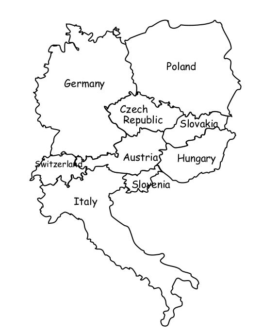

# Constraint Programming Europe_Map
Color a map with the minimum of different colors.

## The map
We consider a map made up of 9 countries which have to be colored. The maps' coloration has to respect the constraint of having the color of each country different from the country where it has a border.

We encode the colors as a set of integers, and the map itself is described by an adjency matrix, encoded into a dictionary.

## The problem

The constraint satisfaction problem is the following :

The set of parameters X is 

It encodes 9 countries by their european code (2 letters).
For every variable x from the set X, the field is

Which encodes 9 colors we want to attribute to every country.
The constraint on countries which share a border is to have different colors, which can be described as the following constraints set C :

&space;CH\right\},\left\{IT&space;<>&space;AT\right\},\left\{IT&space;<>&space;SL\right\},\left\{CH&space;<>&space;AT\right\},\left\{CH&space;<>&space;DE\right\},\left\{AT&space;<>&space;DE\right\},\left\{AT&space;<>&space;SL\right\},\left\{AT&space;<>&space;CZ\right\},\left\{AT&space;<>&space;HU\right\},\left\{AT&space;<>&space;SK\right\}" title="C = [\left\{IT <> CH\right\},\left\{IT <> AT\right\},\left\{IT <> SL\right\},\left\{CH <> AT\right\},\left\{CH <> DE\right\},\left\{AT <> DE\right\},\left\{AT <> SL\right\},\left\{AT <> CZ\right\},\left\{AT <> HU\right\},\left\{AT <> SK\right\}" />
&space;CZ\right\},\left\{DE&space;<>&space;PL\right\},\left\{PL&space;<>&space;CZ\right\},\left\{PL&space;<>&space;SK\right\},\left\{CZ&space;<>&space;SK\right\},\left\{SK&space;<>&space;HU\right\},\left\{HU&space;<>&space;SL\right\}]" title="\left\{DE <> CZ\right\},\left\{DE <> PL\right\},\left\{PL <> CZ\right\},\left\{PL <> SK\right\},\left\{CZ <> SK\right\},\left\{SK <> HU\right\},\left\{HU <> SL\right\}]" />